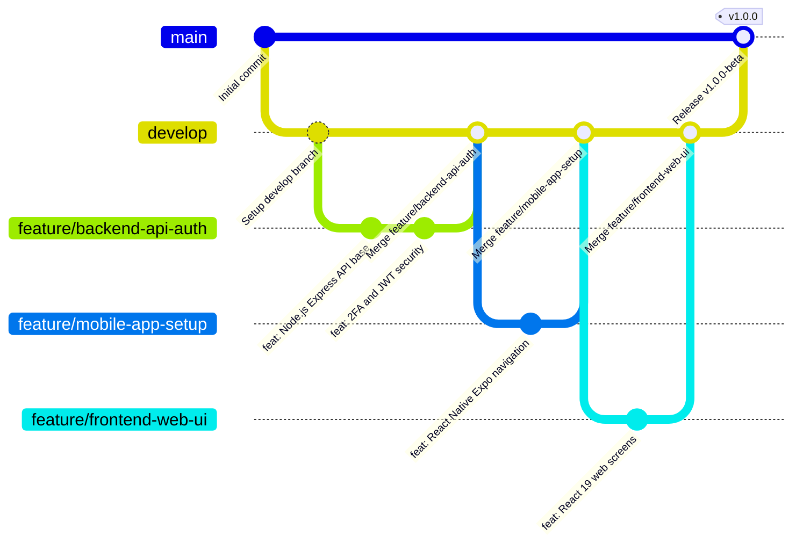

# Informe Técnico: Configuración del Repositorio y Entornos de Desarrollo

**Asignatura:** Ingeniería de Software II  
**Institución:** Fundación Escuela Tecnológica de Neiva (FET)  
**Docente Gestor:** Miguel Antonio Urbano Silva  
**Proyecto:** GuiaSalud Versión 1.0  
**Fecha de Entrega:** Viernes, 18 de septiembre de 2026  
**Repositorio Oficial GitHub:** [https://github.com/David09-web/GuiaSalud](https://github.com/David09-web/GuiaSalud)

---

## 👥 1. Información General y Equipo de Trabajo

### 1.1. Integrantes y Responsabilidades

| Integrante | Rol en el Proyecto | Responsabilidad Principal en el Entregable |
| :--- | :--- | :--- |
| **David Marcet Ospina** | **Backend Lead & DB Architect** | Arquitectura y estructura base de la API REST con Node.js, Express y TypeScript; diseño del modelo relacional en PostgreSQL; implementación de criptografía AES-256-GCM, autenticación JWT con 2FA y configuración del flujo de ramas GitFlow. |
| **Juan Camilo Ramírez** | **Frontend & Mobile Lead** | Estructura base de la aplicación Web SPA/PWA con React 19, TypeScript, Vite y Tailwind CSS v4; diseño del scaffolding de la aplicación móvil en React Native con Expo y React Navigation. |
| **Francisco Trujillo Peralta** | **QA & Security Auditor** | Validación de criterios de ciberseguridad según lineamientos de la OMS, trazabilidad de registros de auditoría (*Audit Logs*), verificación de políticas de exclusión (`.gitignore`) y elaboración del plan de pruebas. |

### 1.2. Fecha Límite de la Actividad
* **Fecha:** Viernes, 18 de septiembre de 2026.
* **Hito:** Entregable 1 — Configuración de repositorio, ramas de trabajo, estructura base multi-proyecto y documentación de entornos.

---

## 🎯 2. Objetivos del Entregable

1. **Centralización y Control de Versiones:** Establecer el repositorio oficial en GitHub (`David09-web/GuiaSalud`) bajo buenas prácticas de ingeniería de software y control de versiones distribuido.
2. **Definición de la Estrategia de Ramas:** Implementar el modelo formal de ramificación **GitFlow** para desacoplar el código en producción de las fases de integración y desarrollo modular.
3. **Estructuración Multi-Proyecto (*Scaffolding* Base):** Diseñar y dejar funcional la arquitectura de carpetas para los tres ecosistemas de la solución:
   - **Backend API REST:** Node.js + Express + TypeScript + PostgreSQL.
   - **Frontend Web:** React 19 + TypeScript + Vite + Tailwind CSS v4.
   - **Frontend Móvil:** React Native + Expo (SDK 52) + TypeScript.
4. **Seguridad y Confidencialidad desde el Diseño:** Asegurar la ausencia total de secretos, tokens o contraseñas en el repositorio mediante plantillas de entorno (`.env.example`) y reglas de exclusión estrictas en `.gitignore` alineadas con las recomendaciones de OWASP.
5. **Documentación Reproducible:** Facilitar guías de instalación y ejecución rápida (*Quick Start*) para que el docente y el equipo puedan levantar los tres entornos en local sin inconsistencias.

---

## 🌿 3. Estrategia de Ramas de Trabajo (GitFlow)

El equipo adoptó el estándar de desarrollo **GitFlow**, el cual organiza las ramas en permanentes y temporales para evitar conflictos de integración y proteger la estabilidad de la rama principal:



### 3.1. Descripción de Ramas

1. **`main` (Producción):**
   - Contiene el código completamente verificado y estable.
   - No recibe commits directos de desarrollo cotidiano. Únicamente se actualiza a través de fusiones (*merges*) validadas desde `develop` o ramas `hotfix/*`.
2. **`develop` (Integración Continua):**
   - Rama central de desarrollo colaborativo donde convergen las características terminadas.
   - Sirve como base para originar y recibir todas las ramas de soporte.
3. **`feature/<módulo>` (Ramas de Características):**
   - Ramas de ciclo de vida temporal creadas exclusivamente a partir de `develop`.
   - Permiten a cada desarrollador trabajar en aislamiento sin afectar el progreso de sus compañeros.
   - **Ramas activas del proyecto:**
     - `feature/backend-api-auth`: Endpoints de autenticación, doble factor (2FA), JWT y seguridad.
     - `feature/frontend-web-ui`: Interfaz de usuario web interactiva con React 19 y Tailwind CSS v4.
     - `feature/mobile-app-setup`: Estructura base móvil con React Native, Expo y navegación por pestañas.
4. **`hotfix/<nombre>` (Correcciones Críticas):**
   - Ramas temporales creadas directamente desde `main` para solventar incidentes críticos o parches de seguridad urgentes.

### 3.2. Convención de Commits (*Conventional Commits*)
Se definieron prefijos estandarizados para los mensajes de confirmación:
* `feat:` Incorporación de nuevas funciones o endpoints (ej. `feat(backend): agregar middleware de auditoría OMS`).
* `fix:` Corrección de fallos técnicos o inconsistencias (ej. `fix(web): corregir padding en modal de historia clínica`).
* `docs:` Cambios enfocados en documentación y diagramas (ej. `docs: actualizar modelo de base de datos PostgreSQL`).
* `chore:` Ajustes de configuración, dependencias o tooling (ej. `chore: configurar tsconfig en entorno móvil`).
* `refactor:` Reorganización o mejora de código sin alterar su comportamiento funcional.

---

## 🏗️ 4. Estructura de Carpetas del Proyecto

El repositorio se organiza mediante un esquema modular desacoplado:

```
GuiaSalud/
├── backend/                               # 🖥️ PROYECTO BACKEND (API REST)
│   ├── src/
│   │   ├── config/                        # Configuración de base de datos PostgreSQL y variables (.env)
│   │   ├── controllers/                   # Controladores REST (Auth, Agenda, Meds, History, Admin)
│   │   ├── middlewares/                   # Autenticación JWT, RBAC, Errores y Auditoría OMS
│   │   ├── routes/                        # Enrutadores /api/v1
│   │   ├── services/                      # Lógica de negocio y Criptografía AES-256-GCM
│   │   ├── types/                         # Interfaces y tipos TypeScript
│   │   ├── app.ts                         # Configuración y middlewares de Express
│   │   └── server.ts                      # Punto de entrada HTTP y conexión a PostgreSQL
│   ├── .env.example                       # Plantilla de variables de entorno (sin secretos reales)
│   ├── .gitignore                         # Reglas de exclusión de dependencias y logs del backend
│   ├── package.json                       # Dependencias y scripts del backend
│   ├── tsconfig.json                      # Configuración del compilador TypeScript
│   └── README.md                          # Documentación específica del backend
│
├── mobile/                                # 📱 PROYECTO MÓVIL (React Native / Expo)
│   ├── src/
│   │   ├── navigation/                    # Stack Navigator y Bottom Tabs
│   │   ├── screens/                       # Pantallas (Inicio, Agenda, Medicinas, Historia, Perfil, Login)
│   │   ├── services/                      # Cliente de consumo API REST
│   │   ├── theme/                         # Paleta de colores y tokens de diseño
│   │   └── types/                         # Definiciones de tipo TypeScript
│   ├── App.tsx                            # Componente raíz de Expo
│   ├── app.json                           # Configuración de empaquetado Expo (Android / iOS)
│   ├── .gitignore                         # Exclusiones de cache Expo, .jks, .p8 y node_modules
│   ├── package.json                       # Dependencias móviles (React Native 0.76, Expo 52)
│   ├── tsconfig.json                      # Configuración TypeScript para React Native
│   └── README.md                          # Guía de ejecución en Expo Go
│
├── src/                                   # 🌐 PROYECTO WEB FRONTEND (React 19 / Vite)
│   ├── components/                        # Componentes reutilizables (TopBar, BottomNav, Modales)
│   ├── screens/                           # Vistas (Admin, Agenda, Historia, Login, Medicamentos, etc.)
│   ├── data.ts                            # Capa de datos inicial y persistencia local
│   ├── types.ts                           # Tipos compartidos
│   ├── index.css                          # Estilos globales y utilidades con Tailwind CSS v4
│   ├── App.tsx                            # Orquestador de vistas, estados y roles RBAC
│   └── main.tsx                           # Punto de entrada React 19
│
├── docs/                                  # 📚 DOCUMENTACIÓN TÉCNICA Y ACADÉMICA
│   ├── API_REST_SPECIFICATION.md          # Especificación formal OpenAPI / Endpoints REST
│   ├── CONFIGURACION_REPOSITORIO_Y_ENTORNOS.md # Informe técnico del entregable 1 (este documento)
│   ├── DATABASE_MODEL_POSTGRESQL.sql     # Script DDL completo de Base de Datos PostgreSQL
│   ├── DIAGRAMA_ER.md                    # Modelo Entidad-Relación y Diccionario de Datos
│   ├── MANUAL_DE_USUARIO_Y_ARQUITECTURA.md# Manual de usuario, arquitectura de capas y roles
│   └── PLAN_PRUEBAS_Y_MATRIZ_RIESGOS_OMS.md # Matriz de riesgos OMS y plan de pruebas
│
├── .gitignore                             # Reglas de exclusión globales del repositorio raíz
├── index.html                             # Shell HTML de Vite
├── package.json                           # Dependencias del Frontend Web
├── tsconfig.json                          # Configuración TypeScript del Frontend Web
├── vite.config.ts                         # Configuración Vite 8 + Tailwind CSS v4
└── README.md                              # Documento principal del repositorio
```

---

## 💻 5. Stack Tecnológico Definitivo y Justificaciones

| Capa / Módulo | Tecnología Seleccionada | Justificación Técnica y Comparativa |
| :--- | :--- | :--- |
| **Backend API** | **Node.js 20 + Express + TypeScript** | Proporciona un entorno asíncrono no bloqueante de alto rendimiento. Se seleccionó sobre Django y Spring Boot para mantener **homogeneidad en TypeScript** en todo el stack (Web, Móvil y Backend), facilitando el tipado compartido y reduciendo el cambio de contexto entre desarrolladores. |
| **Frontend Web** | **React 19 + TypeScript + Tailwind CSS v4 + Vite 8** | Se eligió **React frente a Vue** debido al soporte nativo de Server Actions/Transitions en React 19, su amplia adopción en la industria de salud digital, la madurez del ecosistema de componentes y la integración fluida con Tailwind CSS v4 y librerías de iconos como `lucide-react`. |
| **Frontend Móvil** | **React Native + Expo (SDK 52) + TypeScript** | Se eligió **React Native frente a Flutter** debido a la capacidad de reutilizar directamente contratos de interfaz, tipos de TypeScript y modelos de datos entre el Frontend Web y la aplicación móvil. El SDK de Expo permite pruebas multiplataforma inmediatas mediante código QR sin requerir configuraciones complejas de Gradle/Xcode en etapas iniciales. |
| **Base de Datos** | **PostgreSQL 15+** | Motor relacional robusto con soporte ACID, ideal para garantizar la integridad de citas médicas, cálculo estricto de adherencia farmacológica, índices relacionales y tablas dedicadas de auditoría de accesos. |

---

## 🛡️ 6. Variables de Entorno y Reglas de Exclusión (.gitignore)

### 6.1. Gestión de Variables de Entorno (.env.example)
Siguiendo las recomendaciones de seguridad de **OWASP** (*OWASP Top 10 - Security Misconfiguration & Cryptographic Failures*), **no se suben secretos reales, contraseñas de bases de datos ni llaves maestras al repositorio público**.

En su lugar, se provee el archivo `backend/.env.example` con valores de ejemplo y estructura declarativa:

```env
# Servidor
NODE_ENV=development
PORT=5000
API_PREFIX=/api/v1

# Conexión Base de Datos PostgreSQL
DB_HOST=localhost
DB_PORT=5432
DB_NAME=guiasalud_db
DB_USER=postgres
DB_PASSWORD=postgres_password_123
DB_SSL=false

# Autenticación JWT y 2FA
JWT_SECRET=super_secret_jwt_key_guiasalud_2026_change_in_production
JWT_EXPIRES_IN=24h
JWT_2FA_SECRET=temp_secret_2fa_verification_key

# Cifrado en Reposo AES-256-GCM (Hexadecimal de 64 caracteres / 32 bytes)
ENCRYPTION_KEY=0123456789abcdef0123456789abcdef0123456789abcdef0123456789abcdef

# CORS & Auditoría
CORS_ORIGIN=http://localhost:8443,http://localhost:5173,http://localhost:3000
AUDIT_LOG_FILE=./logs/audit_security.log
```

### 6.2. Reglas de Exclusión en `.gitignore`
Se crearon archivos `.gitignore` segmentados para evitar la carga accidental de artefactos pesados o datos confidenciales:

1. **Raíz (`.gitignore`):** Ignora `node_modules/`, `dist/`, `.env*`, `.cache/`, logs y archivos temporales de Vite/Figma.
2. **Backend (`backend/.gitignore`):** Ignora `node_modules/`, compilados `dist/`, `.env`, archivos de log `*.log` y volcados de depuración.
3. **Móvil (`mobile/.gitignore`):** Ignora carpetas `.expo/`, certificados y llaves móviles (`*.jks`, `*.p8`, `*.p12`, `*.key`, `*.mobileprovision`) y `node_modules/`.

---

## 🔐 7. Medidas de Seguridad Implementadas

1. **Cifrado Simétrico en Reposo (AES-256-GCM):**
   - Los registros e historias clínicas sensibles se procesan mediante el servicio `CryptoService` con vectores de inicialización (`IV`) dinámicos y etiquetas de autenticación (`AuthTag`) para verificar que el contenido no ha sido alterado.
   - *Nota técnica:* Para entornos productivos finales, la clave `ENCRYPTION_KEY` deberá administrarse mediante servicios de custodia de secretos (*AWS KMS, Azure Key Vault o HashiCorp Vault*).
2. **Autenticación en Dos Pasos (2FA) y JWT:**
   - Flujo de autenticación con generación de token temporal para verificación de código de 6 dígitos antes de expedir el JWT final de sesión.
3. **Hasheo Criptográfico de Contraseñas:**
   - Las contraseñas de usuarios nunca se guardan en texto plano; se utiliza el algoritmo `bcryptjs` con factor de coste (*salt rounds*).
4. **Validación de Esquemas con Zod:**
   - Detección temprana de inyecciones y datos malformados en los cuerpos de solicitud HTTP.
5. **Trazabilidad y Auditoría de Accesos Médicos (Directrices OMS):**
   - Middleware de auditoría que registra accesos a la historia clínica (timestamp, usuario, rol, IP y estado), asegurando que los registros de log **no expongan historias clínicas completas, tokens ni contraseñas**.
6. **Cumplimiento de Habeas Data (Ley 1581 de 2012 de Colombia):**
   - Estructura diseñada para garantizar los derechos de acceso, rectificación, revocación de consentimiento y exportación de datos del paciente.

> ⚠️ **Aclaración sobre el Alcance del Prototipo:** Las medidas de seguridad documentadas corresponden a la estructura base y arquitectura de diseño del prototipo. Estas medidas requerirán auditorías de penetración y pruebas de estrés adicionales en fases posteriores del ciclo de vida del software antes de una puesta en producción real.

---

## 🚀 8. Guía de Puesta en Marcha (Entornos de Desarrollo)

### 8.1. Entorno Web (Frontend)
```bash
# Desde la raíz del repositorio:
npm install
npm run dev
```
👉 Acceso en navegador: `http://localhost:8443` (o puerto asignado por Vite).

### 8.2. Entorno Backend (API REST)
```bash
# Desde el directorio backend:
cd backend
npm install
cp .env.example .env
npm run dev
```
👉 API disponible en: `http://localhost:5000/api/v1`  
👉 Endpoint de salud: `http://localhost:5000/api/v1/health`

### 8.3. Entorno Móvil (React Native / Expo)
```bash
# Desde el directorio mobile:
cd mobile
npm install
npx expo start
```
👉 Escanear el código QR con **Expo Go** en un dispositivo físico Android/iOS o presionar `a` para emulador Android.

### 8.4. Base de Datos (PostgreSQL)
```bash
# Cargar el esquema relacional en PostgreSQL:
psql -U postgres -d guiasalud_db -f docs/DATABASE_MODEL_POSTGRESQL.sql
```

---

## 🧪 9. Evidencias de Verificación y Pruebas Mínimas

Se llevaron a cabo pruebas técnicas de verificación en el entorno de desarrollo local con los siguientes resultados:

1. **Compilación Web Frontend (TypeScript + Vite):**
   - Comando: `npm run build`
   - Resultado: **Exitoso**. 30 módulos transformados, generación de bundles en `dist/` en 1.13s sin errores de tipado.
2. **Compilación Backend (TypeScript):**
   - Comando: `npx tsc --noEmit` / `npm run build`
   - Resultado: **Exitoso (Exit code: 0)**. Tipos e interfaces de Express, middlewares y controladores validados al 100%.
3. **Prueba de Ejecución de API REST (Healthcheck y Auth):**
   - Endpoint: `GET /api/v1/health` ➔ Respuesta HTTP 200:
     ```json
     {
       "status": "UP",
       "project": "GuiaSalud Backend API",
       "version": "1.0.0",
       "environment": "development"
     }
     ```
   - Endpoint: `POST /api/v1/auth/login` ➔ Respuesta HTTP 200 con activación de flujo 2FA (`require2FA: true`).
4. **Compilación Móvil (React Native / Expo):**
   - Comando: `npx tsc --noEmit`
   - Resultado: **Exitoso (Exit code: 0)**. Navegación por pestañas y componentes móviles validados sin inconsistencias de tipos.

---

## 📊 10. Estado Actual y Actividades de Cierre

* **Estado del Software:** La **estructura base multi-proyecto se encuentra 100% implementada y verificada a nivel local**.
* **Diferenciación de Alcance:** Se distingue entre la *estructura base implementada* (completada) y la *validación funcional integral en base de datos real* (prevista para las siguientes iteraciones según el cronograma de la asignatura).
* **Actividades Inmediatas de Cierre para el Entregable:**
  1. Ejecutar `git add .`, `git commit` y sincronizar con `origin/main`.
  2. Publicar la rama `develop` en GitHub (`git push -u origin develop`).
  3. Crear y publicar las ramas de características (`feature/backend-api-auth`, `feature/frontend-web-ui`, `feature/mobile-app-setup`) desde `develop`.
  4. Adjuntar capturas de pantalla de evidencia (GitHub, terminal y vistas de ejecución) y exportar el informe final.

---

## 📝 11. Conclusiones

1. Se consolidó una arquitectura multi-proyecto moderna y escalable, integrando **Node.js/Express**, **React 19**, **React Native/Expo** y **PostgreSQL** bajo el lenguaje TypeScript como eje unificador.
2. El uso de la estrategia **GitFlow** garantiza orden en el flujo de trabajo colaborativo, protegiendo las versiones estables y facilitando el trabajo paralelo por módulos.
3. El proyecto adopta buenas prácticas de ciberseguridad desde su concepción inicial (cifrado AES-256-GCM, autenticación 2FA, ausencia de secretos en el repositorio y auditoría OMS), sentando una base sólida para la salud digital.

---

## 📚 12. Referencias Bibliográficas

1. **OWASP Foundation.** (2021). *OWASP Top 10: The Ten Most Critical Web Application Security Risks*. Open Web Application Security Project.
2. **Organización Mundial de la Salud (OMS).** (2020). *Estrategia mundial sobre salud digital 2020–2025*. Ginebra: OMS.
3. **Congreso de la República de Colombia.** (2012). *Ley Estatutaria 1581 de 2012 por la cual se dictan disposiciones generales para la protección de datos personales (Habeas Data)*.
4. **Driessen, V.** (2010). *A successful Git branching model (GitFlow)*. nvie.com.
5. **PostgreSQL Global Development Group.** (2024). *PostgreSQL 15 Documentation: Security and Cryptographic Functions*.
