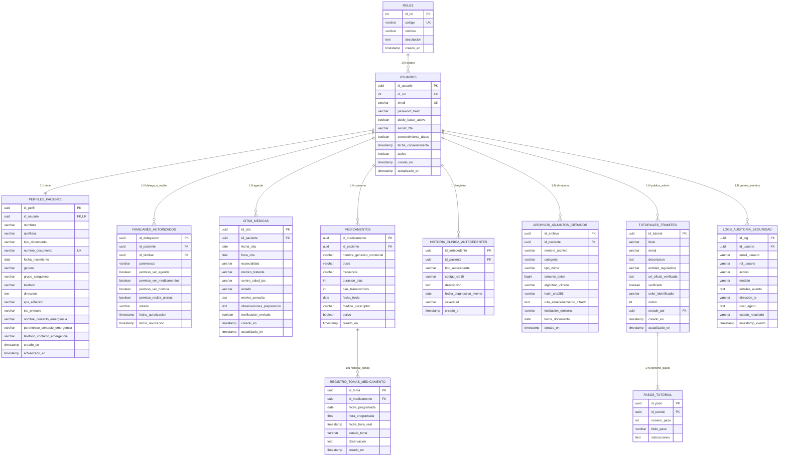

# Modelo Entidad - Relación (E-R) en Tablas - GuiaSalud Versión 1.0

**Proyecto:** GuiaSalud Versión 1.0  
**Asignatura:** Ingeniería de Software II  
**Institución:** Fundación Escuela Tecnológica de Neiva (FET)  
**Docente Gestor:** Miguel Antonio Urbano Silva  
**Líder Backend:** David Marcet Ospina  
**Motor de Base de Datos:** PostgreSQL 15+  

---

## 1. Diagrama Entidad-Relación (Mermaid)

---

## 2. Diccionario de Datos por Tablas

### 2.1 Tabla: `roles` (Control de Acceso RBAC)
| Campo | Tipo de Dato | Clave | Nulo | Restricciones / Valor Defecto | Descripción |
| :--- | :--- | :--- | :--- | :--- | :--- |
| `id_rol` | `SERIAL` | **PK** | No | Auto-incremental | Identificador único del rol. |
| `codigo` | `VARCHAR(20)` | **UK** | No | `UNIQUE` ('PATIENT', 'FAMILY', 'ADMIN') | Código nemotécnico del rol. |
| `nombre` | `VARCHAR(50)` | - | No | - | Nombre descriptivo del rol. |
| `descripcion` | `TEXT` | - | Sí | - | Alcance y permisos del rol. |
| `creado_en` | `TIMESTAMP WITH TZ` | - | No | `CURRENT_TIMESTAMP` | Fecha y hora de creación. |

---

### 2.2 Tabla: `usuarios` (Credenciales y Seguridad 2FA)
| Campo | Tipo de Dato | Clave | Nulo | Restricciones / Valor Defecto | Descripción |
| :--- | :--- | :--- | :--- | :--- | :--- |
| `id_usuario` | `UUID` | **PK** | No | `uuid_generate_v4()` | Identificador universal único del usuario. |
| `id_rol` | `INT` | **FK** | No | `REFERENCES roles(id_rol)` | Llave foránea hacia la tabla roles. |
| `email` | `VARCHAR(150)` | **UK** | No | `UNIQUE` | Correo electrónico institucional o personal. |
| `password_hash` | `VARCHAR(255)` | - | No | Cifrado bcrypt/Argon2 | Hash seguro de la contraseña. |
| `doble_factor_activo` | `BOOLEAN` | - | No | `DEFAULT TRUE` | Estado del 2FA obligatorio. |
| `secret_2fa` | `VARCHAR(64)` | - | Sí | - | Semilla TOTP para apps autenticadoras. |
| `consentimiento_datos`| `BOOLEAN` | - | No | `DEFAULT TRUE` | Aceptación de términos Habeas Data. |
| `fecha_consentimiento`| `TIMESTAMP WITH TZ` | - | No | `CURRENT_TIMESTAMP` | Marca temporal de aceptación de términos. |
| `activo` | `BOOLEAN` | - | No | `DEFAULT TRUE` | Estado de la cuenta (activo/inactivo). |
| `creado_en` | `TIMESTAMP WITH TZ` | - | No | `CURRENT_TIMESTAMP` | Fecha de registro. |
| `actualizado_en` | `TIMESTAMP WITH TZ` | - | No | `CURRENT_TIMESTAMP` | Fecha de última modificación. |

---

### 2.3 Tabla: `perfiles_paciente` (Información Personal y EPS)
| Campo | Tipo de Dato | Clave | Nulo | Restricciones / Valor Defecto | Descripción |
| :--- | :--- | :--- | :--- | :--- | :--- |
| `id_perfil` | `UUID` | **PK** | No | `uuid_generate_v4()` | Identificador único del perfil. |
| `id_usuario` | `UUID` | **FK, UK** | No | `REFERENCES usuarios(id_usuario) ON DELETE CASCADE` | Relación 1:1 con la cuenta de usuario. |
| `nombres` | `VARCHAR(100)` | - | No | - | Nombres del paciente. |
| `apellidos` | `VARCHAR(100)` | - | No | - | Apellidos del paciente. |
| `tipo_documento` | `VARCHAR(10)` | - | No | `DEFAULT 'CC'` ('CC', 'TI', 'CE', 'PPT') | Tipo de documento de identidad. |
| `numero_documento` | `VARCHAR(30)` | **UK** | No | `UNIQUE` | Número único de identificación oficial. |
| `fecha_nacimiento` | `DATE` | - | No | - | Fecha de nacimiento. |
| `genero` | `VARCHAR(20)` | - | Sí | - | Género / Sexo biológico. |
| `grupo_sanguineo` | `VARCHAR(5)` | - | No | ('O+', 'O-', 'A+', 'A-', 'B+', 'AB+', etc.) | Grupo sanguíneo y factor Rh. |
| `telefono` | `VARCHAR(25)` | - | No | - | Número de teléfono de contacto. |
| `direccion` | `TEXT` | - | Sí | - | Dirección de residencia. |
| `eps_afiliacion` | `VARCHAR(100)` | - | No | - | EPS a la que se encuentra afiliado. |
| `ips_primaria` | `VARCHAR(150)` | - | No | - | Centro de salud / IPS asignada. |
| `nombre_contacto_emergencia` | `VARCHAR(150)` | - | No | - | Nombre completo del contacto de emergencia. |
| `parentesco_contacto_emergencia` | `VARCHAR(50)` | - | No | - | Relación/parentesco (Hermano, Hijo, Cónyuge). |
| `telefono_contacto_emergencia` | `VARCHAR(25)` | - | No | - | Línea telefónica de emergencia rápida. |
| `creado_en` | `TIMESTAMP WITH TZ` | - | No | `CURRENT_TIMESTAMP` | Fecha de creación del perfil. |
| `actualizado_en` | `TIMESTAMP WITH TZ` | - | No | `CURRENT_TIMESTAMP` | Fecha de actualización del perfil. |

---

### 2.4 Tabla: `familiares_autorizados` (Delegación de Permisos a Cuidadores)
| Campo | Tipo de Dato | Clave | Nulo | Restricciones / Valor Defecto | Descripción |
| :--- | :--- | :--- | :--- | :--- | :--- |
| `id_delegacion` | `UUID` | **PK** | No | `uuid_generate_v4()` | Identificador de la delegación. |
| `id_paciente` | `UUID` | **FK** | No | `REFERENCES usuarios(id_usuario) ON DELETE CASCADE` | Paciente que otorga el permiso. |
| `id_familiar` | `UUID` | **FK** | No | `REFERENCES usuarios(id_usuario) ON DELETE CASCADE` | Familiar cuidador que recibe el permiso. |
| `parentesco` | `VARCHAR(50)` | - | No | - | Relación familiar o de cuidado. |
| `permiso_ver_agenda` | `BOOLEAN` | - | No | `DEFAULT TRUE` | Autorización para consultar citas. |
| `permiso_ver_medicamentos` | `BOOLEAN` | - | No | `DEFAULT TRUE` | Autorización para consultar recetas y tomas. |
| `permiso_ver_historia` | `BOOLEAN` | - | No | `DEFAULT FALSE` | Autorización para consultar antecedentes. |
| `permiso_recibir_alertas` | `BOOLEAN` | - | No | `DEFAULT TRUE` | Autorización para recibir notificaciones SMS. |
| `estado` | `VARCHAR(20)` | - | No | `DEFAULT 'ACTIVE'` ('ACTIVE', 'PENDING', 'REVOKED') | Estado del acceso delegado. |
| `fecha_autorizacion` | `TIMESTAMP WITH TZ` | - | No | `CURRENT_TIMESTAMP` | Fecha en que se otorgó la delegación. |
| `fecha_revocacion` | `TIMESTAMP WITH TZ` | - | Sí | - | Fecha en que el paciente revocó el acceso. |

---

### 2.5 Tabla: `citas_medicas` (Módulo 1: Agenda Médica)
| Campo | Tipo de Dato | Clave | Nulo | Restricciones / Valor Defecto | Descripción |
| :--- | :--- | :--- | :--- | :--- | :--- |
| `id_cita` | `UUID` | **PK** | No | `uuid_generate_v4()` | Identificador único de la cita médica. |
| `id_paciente` | `UUID` | **FK** | No | `REFERENCES usuarios(id_usuario) ON DELETE CASCADE` | Paciente que agenda la cita. |
| `fecha_cita` | `DATE` | - | No | - | Fecha programada para la atención. |
| `hora_cita` | `TIME` | - | No | - | Hora exacta de la consulta médica. |
| `especialidad` | `VARCHAR(100)` | - | No | - | Especialidad (Medicina General, Cardiología, etc.). |
| `medico_tratante` | `VARCHAR(150)` | - | No | - | Nombre del profesional de la salud. |
| `centro_salud_ips` | `VARCHAR(200)` | - | No | - | Sede o IPS donde se llevará a cabo. |
| `estado` | `VARCHAR(20)` | - | No | `DEFAULT 'PENDING'` ('PENDING', 'DONE', 'CANCELLED') | Estado de la cita médica. |
| `motivo_consulta` | `TEXT` | - | Sí | - | Motivo de la cita o síntomas. |
| `observaciones_preparacion` | `TEXT` | - | Sí | - | Instrucciones previas (ayuno, orden médica). |
| `notificacion_enviada` | `BOOLEAN` | - | No | `DEFAULT FALSE` | Estado del envío de recordatorio. |
| `creado_en` | `TIMESTAMP WITH TZ` | - | No | `CURRENT_TIMESTAMP` | Fecha de registro de la cita. |
| `actualizado_en` | `TIMESTAMP WITH TZ` | - | No | `CURRENT_TIMESTAMP` | Fecha de última actualización. |

---

### 2.6 Tabla: `medicamentos` (Módulo 2: Control de Medicamentos)
| Campo | Tipo de Dato | Clave | Nulo | Restricciones / Valor Defecto | Descripción |
| :--- | :--- | :--- | :--- | :--- | :--- |
| `id_medicamento` | `UUID` | **PK** | No | `uuid_generate_v4()` | Identificador único del tratamiento. |
| `id_paciente` | `UUID` | **FK** | No | `REFERENCES usuarios(id_usuario) ON DELETE CASCADE` | Paciente asignado al tratamiento. |
| `nombre_generico_comercial` | `VARCHAR(150)` | - | No | - | Nombre del fármaco (Ej: Enalapril). |
| `dosis` | `VARCHAR(50)` | - | No | - | Concentración y forma (Ej: 10 mg). |
| `frecuencia` | `VARCHAR(100)` | - | No | - | Posología (Ej: Cada 12 horas). |
| `duracion_dias` | `INT` | - | No | $\gt 0$ | Total de días del tratamiento prescrito. |
| `dias_transcurridos` | `INT` | - | No | `DEFAULT 0` | Días que el paciente lleva tomando el fármaco. |
| `fecha_inicio` | `DATE` | - | No | `DEFAULT CURRENT_DATE` | Fecha de inicio del tratamiento. |
| `medico_prescriptor` | `VARCHAR(150)` | - | Sí | - | Profesional que emitió la fórmula médica. |
| `activo` | `BOOLEAN` | - | No | `DEFAULT TRUE` | Indica si el tratamiento está en curso. |
| `creado_en` | `TIMESTAMP WITH TZ` | - | No | `CURRENT_TIMESTAMP` | Fecha de creación del registro. |

---

### 2.7 Tabla: `registro_tomas_medicamento` (Historial de Adherencia Terapéutica)
| Campo | Tipo de Dato | Clave | Nulo | Restricciones / Valor Defecto | Descripción |
| :--- | :--- | :--- | :--- | :--- | :--- |
| `id_toma` | `UUID` | **PK** | No | `uuid_generate_v4()` | Identificador único del evento de toma. |
| `id_medicamento` | `UUID` | **FK** | No | `REFERENCES medicamentos(id_medicamento) ON DELETE CASCADE` | Medicamento asociado a la toma. |
| `fecha_programada` | `DATE` | - | No | - | Fecha en que correspondía la dosis. |
| `hora_programada` | `TIME` | - | No | - | Hora estipulada de consumo. |
| `fecha_hora_real` | `TIMESTAMP WITH TZ` | - | Sí | - | Momento exacto en que se marcó la toma. |
| `estado_toma` | `VARCHAR(20)` | - | No | ('TAKEN', 'SKIPPED', 'PENDING') | Resultado de la toma (Tomada / Omitida). |
| `observacion` | `TEXT` | - | Sí | - | Nota del paciente o reacción experimentada. |
| `creado_en` | `TIMESTAMP WITH TZ` | - | No | `CURRENT_TIMESTAMP` | Registro en el sistema. |

---

### 2.8 Tabla: `historia_clinica_antecedentes` (Módulo 3: Historia Clínica Personal)
| Campo | Tipo de Dato | Clave | Nulo | Restricciones / Valor Defecto | Descripción |
| :--- | :--- | :--- | :--- | :--- | :--- |
| `id_antecedente` | `UUID` | **PK** | No | `uuid_generate_v4()` | Identificador del antecedente médico. |
| `id_paciente` | `UUID` | **FK** | No | `REFERENCES usuarios(id_usuario) ON DELETE CASCADE` | Paciente titular del antecedente. |
| `tipo_antecedente` | `VARCHAR(50)` | - | No | ('ALERGIA', 'DIAGNOSTICO_CRONICO', 'QUIRURGICO', 'FAMILIAR') | Categoría del antecedente clínico. |
| `codigo_cie10` | `VARCHAR(20)` | - | Sí | - | Código de clasificación internacional CIE-10. |
| `descripcion` | `TEXT` | - | No | - | Detalle clínico del diagnóstico o alergia. |
| `fecha_diagnostico_evento` | `DATE` | - | Sí | - | Fecha de diagnóstico o procedimiento. |
| `severidad` | `VARCHAR(20)` | - | Sí | ('LEVE', 'MODERADA', 'SEVERA') | Nivel de gravedad o riesgo. |
| `creado_en` | `TIMESTAMP WITH TZ` | - | No | `CURRENT_TIMESTAMP` | Fecha de inclusión en el expediente. |

---

### 2.9 Tabla: `archivos_adjuntos_cifrados` (Bóveda Segura de Exámenes)
| Campo | Tipo de Dato | Clave | Nulo | Restricciones / Valor Defecto | Descripción |
| :--- | :--- | :--- | :--- | :--- | :--- |
| `id_archivo` | `UUID` | **PK** | No | `uuid_generate_v4()` | Identificador del archivo clínico. |
| `id_paciente` | `UUID` | **FK** | No | `REFERENCES usuarios(id_usuario) ON DELETE CASCADE` | Paciente propietario del documento. |
| `nombre_archivo` | `VARCHAR(255)` | - | No | - | Nombre original del documento o examen. |
| `categoria` | `VARCHAR(50)` | - | No | ('LABORATORIO', 'IMAGENOLOGIA', 'DIAGNOSTICO', 'RECETA') | Clasificación diagnóstica. |
| `tipo_mime` | `VARCHAR(50)` | - | No | - | Formato del archivo (`application/pdf`, etc.). |
| `tamanio_bytes` | `BIGINT` | - | No | - | Peso en bytes del archivo. |
| `algoritmo_cifrado` | `VARCHAR(30)` | - | No | `DEFAULT 'AES-256-GCM'` | Algoritmo de cifrado en reposo (OMS). |
| `hash_sha256` | `VARCHAR(64)` | - | No | - | Hash SHA-256 para verificación de integridad. |
| `ruta_almacenamiento_cifrado` | `TEXT` | - | No | - | Ruta en el servidor de archivos cifrado. |
| `institucion_emisora` | `VARCHAR(150)` | - | Sí | - | IPS o Laboratorio que emitió el examen. |
| `fecha_documento` | `DATE` | - | No | - | Fecha de realización del estudio. |
| `creado_en` | `TIMESTAMP WITH TZ` | - | No | `CURRENT_TIMESTAMP` | Fecha de carga al sistema. |

---

### 2.10 Tabla: `tutoriales_tramites` (Módulo 5: Tutoriales de Trámites)
| Campo | Tipo de Dato | Clave | Nulo | Restricciones / Valor Defecto | Descripción |
| :--- | :--- | :--- | :--- | :--- | :--- |
| `id_tutorial` | `UUID` | **PK** | No | `uuid_generate_v4()` | Identificador único del tutorial. |
| `titulo` | `VARCHAR(200)` | - | No | - | Título del trámite de salud. |
| `emoji` | `VARCHAR(10)` | - | No | `DEFAULT '📄'` | Icono representativo del trámite. |
| `descripcion` | `TEXT` | - | No | - | Resumen del trámite y su objetivo. |
| `entidad_reguladora` | `VARCHAR(150)` | - | No | - | Entidad oficial (Supersalud, Minsalud, etc.). |
| `url_oficial_verificada` | `TEXT` | - | No | - | Enlace web oficial verificado del SGSSS. |
| `verificado` | `BOOLEAN` | - | No | `DEFAULT TRUE` | Sello de verificación por el Administrador. |
| `color_identificador` | `VARCHAR(20)` | - | No | `DEFAULT '#EBF3FD'` | Color de interfaz de la tarjeta. |
| `orden` | `INT` | - | No | `DEFAULT 0` | Prioridad de visualización en la interfaz. |
| `creado_por` | `UUID` | **FK** | Sí | `REFERENCES usuarios(id_usuario)` | Administrador que redactó la guía. |
| `creado_en` | `TIMESTAMP WITH TZ` | - | No | `CURRENT_TIMESTAMP` | Fecha de publicación. |
| `actualizado_en` | `TIMESTAMP WITH TZ` | - | No | `CURRENT_TIMESTAMP` | Fecha de última edición. |

---

### 2.11 Tabla: `pasos_tutorial` (Pasos Secuenciales del Trámite)
| Campo | Tipo de Dato | Clave | Nulo | Restricciones / Valor Defecto | Descripción |
| :--- | :--- | :--- | :--- | :--- | :--- |
| `id_paso` | `UUID` | **PK** | No | `uuid_generate_v4()` | Identificador único del paso. |
| `id_tutorial` | `UUID` | **FK** | No | `REFERENCES tutoriales_tramites(id_tutorial) ON DELETE CASCADE` | Tutorial al que pertenece. |
| `numero_paso` | `INT` | - | No | $\ge 1$ | Orden secuencial (1, 2, 3...). |
| `titulo_paso` | `VARCHAR(200)` | - | No | - | Título conciso de la acción a realizar. |
| `instrucciones` | `TEXT` | - | No | - | Descripción detallada de cómo ejecutar el paso. |

---

### 2.12 Tabla: `logs_auditoria_seguridad` (Trazabilidad OMS y Ciberseguridad)
| Campo | Tipo de Dato | Clave | Nulo | Restricciones / Valor Defecto | Descripción |
| :--- | :--- | :--- | :--- | :--- | :--- |
| `id_log` | `UUID` | **PK** | No | `uuid_generate_v4()` | Identificador del registro auditor. |
| `id_usuario` | `UUID` | **FK** | Sí | `REFERENCES usuarios(id_usuario) ON DELETE SET NULL` | Usuario que ejecutó la acción. |
| `email_usuario` | `VARCHAR(150)` | - | Sí | - | Correo del usuario en el momento del evento. |
| `rol_usuario` | `VARCHAR(30)` | - | Sí | - | Rol activo ('PATIENT', 'FAMILY', 'ADMIN'). |
| `accion` | `VARCHAR(100)` | - | No | - | Acción ('LOGIN_2FA', 'ACCESS_HISTORY', etc.). |
| `modulo` | `VARCHAR(50)` | - | No | - | Módulo afectado (Autenticación, Historia, etc.). |
| `detalles_evento` | `TEXT` | - | Sí | - | Descripción detallada del suceso. |
| `direccion_ip` | `VARCHAR(45)` | - | No | - | Dirección IP de origen (IPv4 o IPv6). |
| `user_agent` | `TEXT` | - | Sí | - | Navegador y sistema operativo del cliente. |
| `estado_resultado` | `VARCHAR(20)` | - | No | ('SUCCESS', 'WARNING', 'DENIED') | Resultado de la operación. |
| `timestamp_evento` | `TIMESTAMP WITH TZ` | - | No | `CURRENT_TIMESTAMP` | Marca de tiempo inmutable del evento. |

---

## 3. Matriz de Relaciones y Cardinalidades

| Entidad Origen | Cardinalidad | Entidad Destino | Clave Foránea | Regla On Delete | Propósito de la Relación |
| :--- | :---: | :--- | :--- | :--- | :--- |
| `roles` | **$1 : N$** | `usuarios` | `usuarios.id_rol` $\rightarrow$ `roles.id_rol` | `RESTRICT` | Clasifica a cada usuario en un rol de seguridad (RBAC). |
| `usuarios` | **$1 : 1$** | `perfiles_paciente` | `perfiles_paciente.id_usuario` $\rightarrow$ `usuarios.id_usuario` | `CASCADE` | Asocia los datos personales y de EPS al paciente. |
| `usuarios` (Paciente) | **$1 : N$** | `familiares_autorizados` | `familiares_autorizados.id_paciente` $\rightarrow$ `usuarios.id_usuario` | `CASCADE` | Permite al paciente delegar accesos a familiares. |
| `usuarios` (Familiar) | **$1 : N$** | `familiares_autorizados` | `familiares_autorizados.id_familiar` $\rightarrow$ `usuarios.id_usuario` | `CASCADE` | Vincula al familiar autorizado que cuidará al paciente. |
| `usuarios` | **$1 : N$** | `citas_medicas` | `citas_medicas.id_paciente` $\rightarrow$ `usuarios.id_usuario` | `CASCADE` | Almacena la agenda de citas programadas del paciente. |
| `usuarios` | **$1 : N$** | `medicamentos` | `medicamentos.id_paciente` $\rightarrow$ `usuarios.id_usuario` | `CASCADE` | Registra los tratamientos farmacológicos del paciente. |
| `medicamentos` | **$1 : N$** | `registro_tomas_medicamento` | `registro_tomas_medicamento.id_medicamento` $\rightarrow$ `medicamentos.id_medicamento` | `CASCADE` | Registra cronológicamente cada toma realizada u omitida. |
| `usuarios` | **$1 : N$** | `historia_clinica_antecedentes` | `historia_clinica_antecedentes.id_paciente` $\rightarrow$ `usuarios.id_usuario` | `CASCADE` | Almacena diagnósticos crónicos (CIE-10), alergias y cirugías. |
| `usuarios` | **$1 : N$** | `archivos_adjuntos_cifrados` | `archivos_adjuntos_cifrados.id_paciente` $\rightarrow$ `usuarios.id_usuario` | `CASCADE` | Bóveda de archivos médicos protegidos con AES-256. |
| `tutoriales_tramites` | **$1 : N$** | `pasos_tutorial` | `pasos_tutorial.id_tutorial` $\rightarrow$ `tutoriales_tramites.id_tutorial` | `CASCADE` | Desglosa la guía de trámite en pasos secuenciales. |
| `usuarios` (Admin) | **$1 : N$** | `tutoriales_tramites` | `tutoriales_tramites.creado_por` $\rightarrow$ `usuarios.id_usuario` | `SET NULL` | Identifica qué administrador publicó o editó la guía. |
| `usuarios` | **$1 : N$** | `logs_auditoria_seguridad` | `logs_auditoria_seguridad.id_usuario` $\rightarrow$ `usuarios.id_usuario` | `SET NULL` | Auditoría de ciberseguridad inmutable exigida por la OMS. |
